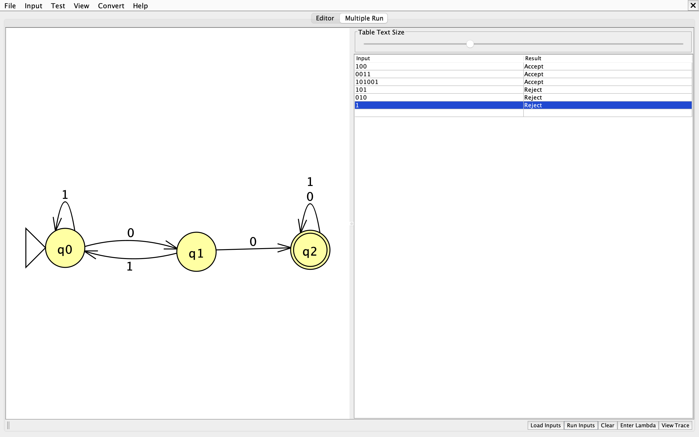

# Lista de Exercícios — Autômatos Finitos Determinísticos (AFD)

> **Disciplina:** Teoria das Linguagens e Autômatos  
> **Tema:** Autômatos Finitos Determinísticos  
> **Modalidade:** Atividade prática em grupo  
> **Objetivo:** identificar, interpretar, construir e testar AFDs.

---

## Identificação do grupo

| Campo | Preenchimento |
|---|---|
| Turma | N1_3132_-_C.C_(Not) |
| Data | 01/09/2026 |
| Integrante 1 | Danilo Hellu Santos Ramos |
| Integrante 2 | João Paulo De Oliveira Paiva |
| Integrante 3 | Victor Hugo Valadares Mendonça |

## Orientações

- Registre o raciocínio utilizado em cada resposta.
- Nos exercícios com cadeias, apresente o caminho percorrido estado por estado.
- Nos exercícios de construção, entregue a quíntupla, a tabela de transição e o diagrama.
- Use `ε` para representar a cadeia vazia.
- Quando solicitado, implemente e teste o autômato no JFLAP.

---

# Parte 1 — Fundamentos

## Exercício 1 — Entendendo um autômato finito

Uma lâmpada controlada por um interruptor possui os estados `Desligado` e `Ligado`. Sempre que o botão é pressionado, ocorre a mudança:

```text
Desligado --pressionar--> Ligado
Ligado    --pressionar--> Desligado
```

Responda:

1. Quantos estados existem?
   R:2 estados 
3. Qual é o estado inicial, considerando que a lâmpada começa apagada?
   R:Desligada
4. Qual entrada provoca uma transição?
   R:Pressionar
5. Partindo de `Desligado`, qual será o estado após um acionamento?
  R:Ligado
6. Partindo de `Desligado`, qual será o estado após dois acionamentos?
   R:Desligado
7. Explique o funcionamento do sistema com suas palavras.
   R:O sistema do interruptor funciona de maneira "normal", a cada pressionada ele troca do estado atual para atuar a função desejada "ligado" ou "desligado" para acender ou apagar a lâmpada  

## Exercício 2 — Porta automática

Uma porta automática possui os estados `Fechado` e `Aberto`. O sensor identifica `pessoa_detectada` ou `nenhuma_pessoa`. Quando uma pessoa é detectada, a porta deve ficar aberta; quando ninguém é detectado, deve ficar fechada.

Complete a tabela:

| Estado atual | Entrada | Próximo estado |
|---|---|---|
| Fechado | pessoa_detectada | |
| Fechado | nenhuma_pessoa | |
| Aberto | pessoa_detectada | |
| Aberto | nenhuma_pessoa | |

Depois, desenhe o diagrama de estados correspondente e indique o estado inicial.

---

# Parte 2 — Anatomia e definição formal

## Exercício 3 — Identificando os elementos

Considere um AFD com `Σ = {0,1}`, `Q = {q0,q1}`, estado inicial `q0`, estado final `q1` e as transições abaixo:

| δ | 0 | 1 |
|---|---|---|
| q0 | q0 | q1 |
| q1 | q0 | q1 |

Identifique e explique:

1. o alfabeto `Σ`;
   **R:** `Σ = {0, 1}`. É o conjunto finito de símbolos (ou caracteres) de entrada que o autômato é capaz de ler e processar.
2. o conjunto de estados `Q`;
   **R:** `Q = {q0, q1}`. Representa todas as situações (ou configurações) possíveis e finitas nas quais o autômato pode se encontrar durante a sua execução.
3. o estado inicial;
   **R:** `q0`. É o estado de partida, ou seja, o estado em que o autômato sempre inicia a leitura de uma determinada cadeia de entrada.
4. o conjunto de estados finais `F`;
   **R:** `F = {q1}`. É o conjunto de estados de aceitação. Se, após ler toda a cadeia de caracteres, o autômato parar em um desses estados, a palavra é considerada aceita (válida) pela linguagem.
5. os símbolos que podem ser lidos;
   **R:** Os símbolos `0` e `1`. Estes correspondem exatamente aos elementos definidos no alfabeto `Σ`.
6. o significado do círculo duplo em um diagrama;
   **R:** Em um diagrama de transição de estados (grafo), o círculo duplo serve para identificar visualmente um **estado final** (ou estado de aceitação).
7. o significado da seta sem origem apontando para um estado.
   **R:** Indica o **estado inicial** do autômato. É a indicação visual de onde o processamento da cadeia de texto deve começar.

## Exercício 4 — A quíntupla do AFD

Um AFD é formalmente representado por:

```text
M = (Σ, Q, δ, q0, F)
```

Complete:

| Elemento | Significado |
|---|---|
| `Σ` | |
| `Q` | |
| `δ` | |
| `q0` | |
| `F` | |

Explique por que esses cinco elementos são suficientes para definir o funcionamento de um AFD.

---

# Parte 3 — Tabela de transições e cadeias

## Exercício 5 — Interpretando uma tabela

Considere `Σ = {0,1}`, `Q = {q0,q1,q2}`, estado inicial `q0`, `F = {q1}` e:

| δ | 0 | 1 |
|---|---|---|
| q0 | q0 | q1 |
| q1 | q2 | q1 |
| q2 | q1 | q1 |

Responda:

1. Qual é o resultado de `δ(q0,0)`?
  R:q0
2. Qual é o resultado de `δ(q0,1)`?
  R:q1
3. Qual é o resultado de `δ(q1,0)`?
   R:q2
4. Qual é o resultado de `δ(q2,1)`?
  R:q1
5. Qual é o estado de aceitação?
  R:q1 F= q1
6. Desenhe o diagrama correspondente à tabela.
0
   +-------+
   |       v
-> (q0) --1--> ((q1)) <--0-- [q2]
                | ^          ^  ^
                | |          |  |
                +-1----------+--+ (q2 transita para q1 com 0 e 1)

7. Justifique por que o autômato é determinístico.
   R:Ele é determinístico porque, para cada estado e para cada entrada (0 ou 1), existe apenas um único destino possível, sem ambiguidades ou opções múltiplas.

## Exercício 6 — Aceita ou rejeita?

Utilize o AFD do Exercício 5. Determine se cada cadeia é aceita ou rejeitada:

```text
a) 1
b) 0011001
c) 010010
d) 1101
e) 000011010
```

Para cada cadeia, registre todas as transições. Exemplo:

```text
Cadeia: 01
q0 --0--> q0
q0 --1--> q1
Estado final: q1
Resultado: ACEITA
```

| Cadeia | Caminho percorrido | Estado final | Resultado |
|---|---|---|---|
| `1` | q0 --1--> q1 | q1 | ACEITA |
| `0011001` | q0 --0--> q0 q0 --0--> q0 q0 --1--> q1 q1 --1--> q1 q1 --0--> q2 q2 --0--> q1 q1 --1--> q1 | q1 | ACEITA |
| `010010` | q0 --0--> q0 q0 --1--> q1 q1 --0--> q2 q2 --0--> q1 q1 --1--> q1 q1 --0--> q2 | q2 | REJEITA |
| `1101` | q0 --1--> q1 q1 --1--> q1 q1 --0--> q2 q2 --1--> q1 | q1 | ACEITA |
| `000011010` | q0 --0--> q0 q0 --0--> q0 q0 --0--> q0 q0 --0--> q0 q0 --1--> q1 q1 --1--> q1 q1 --0--> q2 q2 --1--> q1 q1 --0--> q2 | q2 | REJEITA |


---

# Parte 4 — Construção de AFDs

## Exercício 7 — Cadeias que terminam em `1`

Construa um AFD sobre `Σ = {0,1}` que reconheça todas as cadeias que terminam em `1`.

- Devem ser aceitas: `1`, `01`, `101`, `0001`, `1101`.
- Devem ser rejeitadas: `ε`, `0`, `10`, `100`, `1110`.

Entregue: conjunto de estados, alfabeto, estado inicial, estados finais, tabela, diagrama e teste de pelo menos cinco cadeias.

## Exercício 8 — Número par de símbolos `1`

Construa um AFD sobre `Σ = {0,1}` que reconheça cadeias com quantidade par de símbolos `1`.
M = (Σ, Q, δ, q0, F)

Σ = {0, 1}

Q = {q0, q1}

q0 = Estado inicial (representa a quantidade par de 1)

F = {q0} (Estado de aceitação)

δ (Função de transição):

δ(q0, 0) = q0

δ(q0, 1) = q1

δ(q1, 0) = q1

δ(q1, 1) = q0

Analise: `ε`, `0`, `1`, `11`, `101`, `1100` e `10101`.
2. Tabela de Transição
| δ (estado atual) |0 | 1 |  
| :---             | :---| :---|
| -> *q0           | q0 | q1 |
| q1               | q1 | q0 |

Apresente a definição formal `M = (Σ, Q, δ, q0, F)`, a tabela, o diagrama e o processamento das cadeias. Lembre-se de que basta controlar duas situações: quantidade par ou ímpar de símbolos `1`.
0                 0
  |───┐             |───┐
  ▼   │     1       ▼   │
►((q0)) ────────► (q1) ─┘
   ▲                │
   │        1       │
   └────────────────┘
Processamento: Inicia e termina em q0.
Resultado: q0 -> Aceita
0

Processamento: q0 --0--> q0
Resultado: q0 -> Aceita
1

Processamento: q0 --1--> q1
Resultado: q1 -> Rejeita
11

Processamento: q0 --1--> q1 --1--> q0
Resultado: q0 -> Aceita
101

Processamento: q0 --1--> q1 --0--> q1 --1--> q0
Resultado: q0 -> Aceita
1100

Processamento: q0 --1--> q1 --1--> q0 --0--> q0 --0--> q0
Resultado: q0 -> Aceita
10101

Processamento: q0 --1--> q1 --0--> q1 --1--> q0 --0--> q0 --1--> q1
Resultado: q1 -> Rejeita

## Exercício 9 — Pelo menos dois zeros consecutivos

Construa um AFD para:

```text
L(M) = {w ∈ {0,1}* | w possui pelo menos dois 0s consecutivos}
```

- Devem ser aceitas: `00`, `001`, `100`, `1001`, `110011`, `0000`.
- Devem ser rejeitadas: `ε`, `0`, `1`, `01`, `10`, `10101`.

Responda antes de construir:

1. O que o estado inicial representa?
2. O que ocorre quando aparece o primeiro `0`?
3. O que ocorre quando outro `0` aparece imediatamente depois?
4. Depois de encontrar `00`, a cadeia pode deixar de ser aceita?
5. Quantos estados são necessários?

Apresente a quíntupla, a tabela, o diagrama e os testes.

---

# Parte 5 — Desafios de modelagem

## Exercício 10 — Semáforo

Modele um semáforo com os estados `Verde`, `Amarelo` e `Vermelho`. Use a entrada `tempo` e represente o ciclo:

```text
Verde → Amarelo → Vermelho → Verde
```

Entregue o diagrama, a tabela de transições, a definição formal e uma explicação do funcionamento. Discuta se há sentido em definir estados de aceitação nesse modelo e justifique a escolha adotada.

## Exercício 11 — Sistema de login

Modele um sistema com as entradas `senha_correta` e `senha_incorreta`. Uma senha correta autentica o usuário; após três tentativas incorretas, o sistema fica bloqueado.

Determine:

1. todos os estados necessários para contar as tentativas;
2. o alfabeto de entrada;
3. o estado inicial;
4. os estados finais;
5. todas as transições;
6. o comportamento após a autenticação e após o bloqueio.

Responda: apenas os estados `Aguardando`, `Autenticado` e `Bloqueado` são suficientes para controlar três tentativas? Justifique e construa o AFD completo.

---

# Parte 6 — Prática no JFLAP

## Exercício 12 — Implementação e testes

Escolha um dos AFDs dos exercícios 7, 8 ou 9 e implemente-o no JFLAP.

1. Crie os estados.
2. Defina o estado inicial e os estados finais.
3. Crie todas as transições.
4. Teste três cadeias que devem ser aceitas.
5. Teste três cadeias que devem ser rejeitadas.
6. Compare os resultados esperados e obtidos.

Inclua um print do AFD, a tabela de testes e uma breve explicação.

| Cadeia | Resultado esperado | Resultado no JFLAP | Conferência |
|---|---|---|---|
| | | | |
| | | | |
| | | | |
| | | | |
| | | | |
| | | | |

---

### Resolução - AFD do Exercício 7

**Explicação:** 
Para este exercício, foi implementado o AFD que reconhece a linguagem de todas as cadeias sobre o alfabeto `Σ = {0,1}` que possuem a substring `"00"`. 
- `q0` é o estado inicial (onde a leitura começa).
- `q1` é o estado alcançado após ler o primeiro `0` da sequência.
- `q2` é o estado final/de aceitação, alcançado assim que a cadeia identifica o segundo `0` consecutivo. Ao chegar em `q2`, o autômato permanece lá para qualquer símbolo lido (`0` ou `1`), caracterizando a aceitação da cadeia.

**Print do AFD no JFLAP:**


### Tabela de Testes

| Cadeia | Resultado esperado | Resultado no JFLAP | Conferência |
|---|---|---|---|
| `100` | Aceita | Accept | OK |
| `0011` | Aceita | Accept | OK |
| `101001` | Aceita | Accept | OK |
| `101` | Rejeitada | Reject | OK |
| `010` | Rejeitada | Reject | OK |
| `1` | Rejeitada | Reject | OK |

---

# Desafio final

## Exercício 13 — Crie seu próprio problema

Escolha uma situação real representável por estados, como elevador, máquina de vendas, controle de acesso, estacionamento, pedido de delivery, semáforo, porta eletrônica ou protocolo de comunicação.

O grupo deverá:

1. descrever o problema e suas regras;
2. identificar as entradas e os estados;
3. definir o estado inicial e os estados finais;
4. criar a tabela de transições;
5. desenhar o AFD;
6. apresentar `M = (Σ, Q, δ, q0, F)`;
7. testar pelo menos cinco sequências de entrada;
8. explicar por que o modelo é determinístico;
9. apresentar uma conclusão sobre o que foi aprendido.

---

# Entregável

O grupo deverá entregar um único arquivo `README.md`, contendo:

- identificação do grupo;
- respostas dos exercícios indicados pela professora;
- diagramas e tabelas de transição;
- processamento estado por estado das cadeias;
- evidência dos testes no JFLAP;
- conclusão do grupo.

## Modelo para o desafio final

```markdown
## Desafio final

### Problema escolhido

### Estados e significado

### Alfabeto

### Estado inicial e estados finais

### Tabela de transições

### Diagrama

### Definição formal
M = (Σ, Q, δ, q0, F)

### Testes realizados
| Entrada | Resultado esperado | Resultado obtido |
|---|---|---|
| | | |

### Evidência no JFLAP

### Conclusão
```

> **Importante:** não basta apresentar o diagrama. Demonstre como o AFD processa cada cadeia, estado por estado, até decidir pela aceitação ou rejeição.

---

**Profa. Kadidja Valéria**
